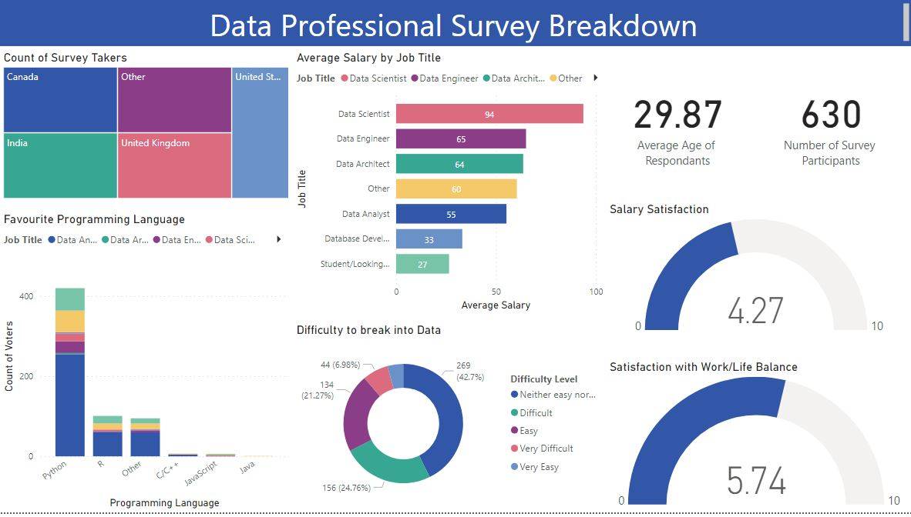

# Data_Professional_Survey_Analysis
Unlocking Insights: A Data Professional's Journey through Power BI Analytics

# Dataset
The Dataset used for this analysis has been fetch from the survey held on different social media like Linkedin,Twitter,Instagram etc. It contain 600+ records of different respondants with 25+ columns.

The following Data professsional activity is included in this dataset:

* Different Job roles, Industries, Programming language used by a Data Professional.
* unique id for each respondent and Satisfaction related to factors like Salary, Work/Life balance, Coworkers, Management etc.
* Difficulty level of breaking into Data roles & many more factors to gain insights into Data Profession.

# Objective

The objective of this Project using Power BI is to explore contemporary data professional interests and understand factors influencing them. Leveraging Power BI's robust data visualization, analysis, and predictive features, the project aims to uncover insights into the factors affecting data professionals, quantifying their impact. Through interactive dashboards, the analysis will provide a comprehensive view, enhancing decision-making processes in the data professional domain.

# Inspiration

* What is the demographic profile of today's data professionals, including age, gender, and geographic location?
* Which skills are most commonly align with respective profession?
* Which programming languages and tools are most commonly used by data professionals?
* How do data professionals perceive their work-life balance in relation to their job satisfaction?
* What is the current job market demand for data professionals in various regions?
  
# Insights

* Average Age of Data Professionals is around 29-30.
* Data Scientist is the Data Role with most Income.
* The msot sought after programming language is Python followed by R & others like SQL.
* The Difficulty level of cracking into Data Role as learned from Dashboard are neither too difficult nor very easy.
* The Dashboard makes it easy to see the general trends involving Data Roles satisfaction rates resepctively.

# Dashboard

